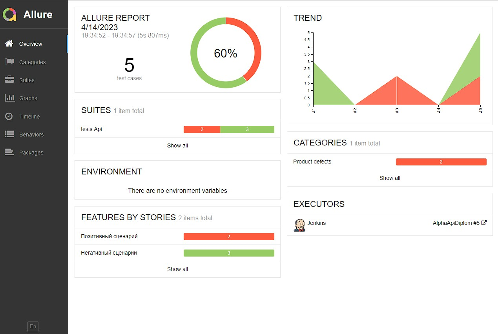
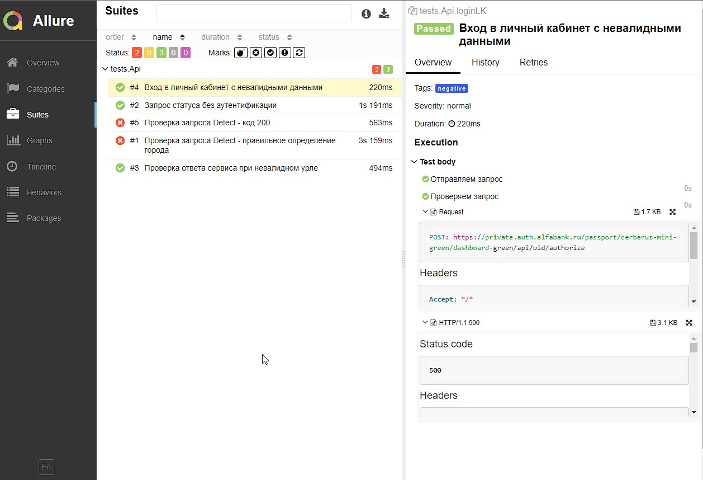
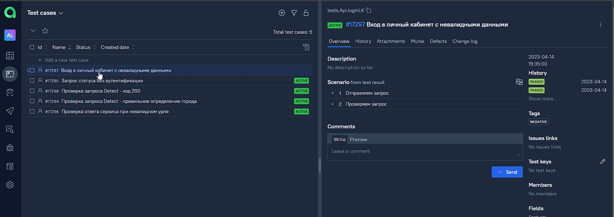
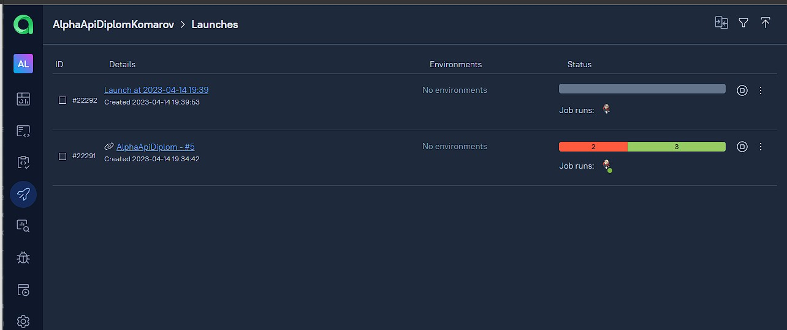

<h1 >Проект автоматизации API для сайта <a href="https://alfabank.ru/ ">alfabank.ru</a></h1>

## <a name="Содержание">Содержание</a>
+ [Описание](#Описание)
+ [Стек технологий](#стек-технологий)
+ [Запуск тестов](#Запуск-тестов)
+ [Сборка в Jenkins](#jenkins-job)
+ [Allure отчеты:](#Allure-отчеты)
+ [Уведомление в Telegram](#telegram-уведомления)
+ [Интеграция с Jira](#Jira-интеграция)
+ [Видео прохождения тестов](#selenoid-видеозапись-тестов)

## <a name="Описание">Описание</a>
Тестовый проект состоит из веб-тестов (UI), тестов API и мобильных тестов (Android).\
Краткий список интересных фактов о проекте:
- [x] `Page Object` проектирование
- [x] Параметризованные тесты
- [x] Различные файлы конфигурации для запуска теста в зависимости от параметров сборки
- [x] Конфигурация с библиотекой `Owner`
- [x] Использование `Lombok` для моделей в API тестах
- [x] Использование request/response спецификаций для API тестов
- [x] Custom Allure listener для API requests/responses логов
- [x] Интеграция с `Allure TestOps`
- [x] Автотесты как тестовая документация
- [x] Интеграция с `Jira`


## Технологии и инструменты

<p align="center">


</p>

## <a name="Запуск тестов">Запуск тестов</a>
#### Про конфигурации
Файлы конфигурации должны находиться по пути:
```
src/test/resources
```
Креды вынесены в отдельный конфиг файл - `credential.properties`\
Ожидаемые конфиги прописаны у соответсвующих команд.

#### Команды запуска тестов 
API тесты
```
gradle clean test
gradle clean negative
gradle clean positive
```

[Вернуться к оглавлению](#Содержание)

## Запуск тестов в Jenkins

> Сборка с параметрами позволяет перед запуском изменить параметры для сборки (путем выбора из списка или прямым указанием значения).
<p align="center">
</a>
</p>

<a id="allure"></a>
## Отчеты в Allure

### Основное окно

<p align="center">

</p>

### Тесты

<p align="center">

</p>

<a id="testops"></a>
## Интеграция с Allure TestOps 

### Тест-кейсы
<p align="center">

</p>


### Пример запуска тест-кейсов
<p align="center">

</p>

<a id="jira"></a>
## Интеграция с Jira 
<p align="center">

</p>

<a id="telegram"></a>
## Уведомления в Telegram с использованием бота

<p>

</p>
